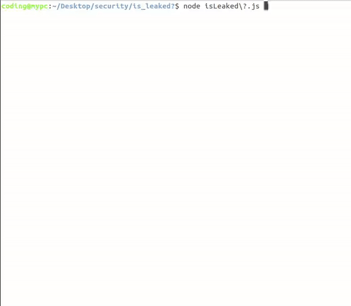

# is_leaked
A tool to search databases entries easily

Before running it:

run the following command

    npm i prompt-sync
    
    
## Then it is pretty easy to use

get Databases where the entries are in this form: `value1:value2:value3:...`

you can get lots of databases from here https://mega.nz/folder/EnxggCiY#btfevmu3fO4AQrWe-81z6A/folder/hm50kRBJ hurry before they are deleted

